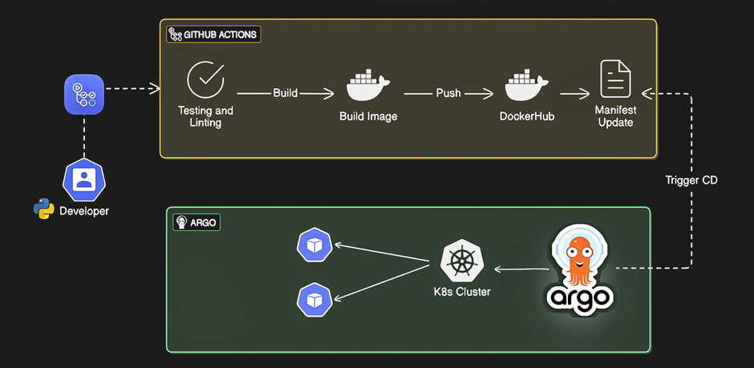
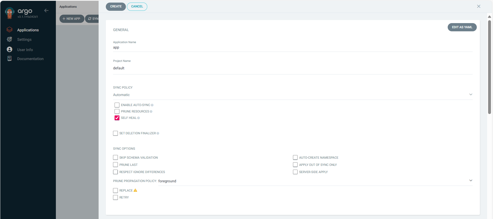
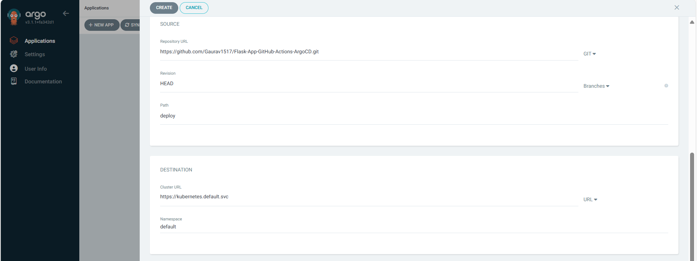
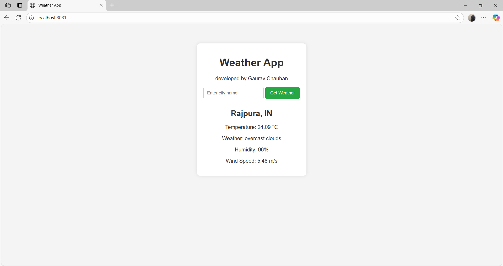

# Complete CI/CD DevOps Project 🚀
### Deploy Python Flask App on Kubernetes cluster with GitOps Approach. 



---

##  Tools Used

**VS Code** • **Linux** • **Python** • **Flask** • **Docker** • **Git** • **GitHub** • **GitHub Actions** • **Docker Hub** • **Minikube** • **Kubernetes** • **Argo CD**


<a href="https://code.visualstudio.com/Docs">
  
</a>
<a href="https://www.kernel.org/doc/html/latest/">
  
</a>
<a href="https://docs.python.org/3/">
  
</a>
<a href="https://flask.palletsprojects.com/en/stable/">
  
</a>
<a href="https://docs.docker.com/">
  
</a>
<a href="https://git-scm.com">
  
</a>
<a href="https://github.com">
  
</a>
<a href="https://docs.github.com/en/actions">
  
</a>
<a href="https://hub.docker.com/">
<svg width="80"
    height="80" class="MuiBox-root css-1w384qp" data-testid="HubLogo" viewBox="0 0 62 19" xmlns="http://www.w3.org/2000/svg"><path d="M23.6096 7.78281C23.0211 7.38668 21.4751 7.21752 20.3513 7.52051C20.291 6.40098 19.7132 5.45739 18.6572 4.63407L18.2664 4.37177L18.0059 4.7654C17.4937 5.54269 17.2778 6.5787 17.3542 7.52051C17.4145 8.10079 17.6162 8.75281 18.0059 9.22603C16.543 10.0747 15.1944 9.88197 9.22236 9.88197H0.00204151C-0.0247244 11.2306 0.191901 13.8244 1.84139 15.9361C2.02376 16.1695 2.22326 16.395 2.44024 16.6124C3.78139 17.9553 5.80775 18.9403 8.83765 18.9428C13.4603 18.9471 17.4206 16.4482 19.8299 10.4069C20.6225 10.4198 22.7152 10.549 23.7395 8.57009C23.7645 8.5369 24 8.04548 24 8.04548L23.6096 7.78317V7.78281ZM6.01938 6.5498H3.42665V9.14252H6.01938V6.5498ZM9.36868 6.5498H6.77596V9.14252H9.36868V6.5498ZM12.7183 6.5498H10.1256V9.14252H12.7183V6.5498ZM16.068 6.5498H13.4753V9.14252H16.068V6.5498ZM2.66971 6.5498H0.0769861V9.14252H2.66971V6.5498ZM6.01938 3.27508H3.42665V5.8678H6.01938V3.27508ZM9.36868 3.27508H6.77596V5.8678H9.36868V3.27508ZM12.7183 3.27508H10.1256V5.8678H12.7183V3.27508ZM12.7183 0H10.1256V2.59272H12.7183V0Z"></path><path d="M31.212 11.104V16H28.296V2.752H31.212V8.116C31.572 7.504 32.598 6.478 34.218 6.478C36.54 6.478 38.016 8.152 38.016 10.51V16H35.082V11.104C35.082 9.862 34.326 9.07 33.156 9.07C31.986 9.07 31.212 9.88 31.212 11.104ZM44.1492 16.216C40.9812 16.216 39.3072 14.38 39.3072 11.752V6.676H42.2412V11.536C42.2412 12.724 42.8892 13.534 44.0952 13.534C45.3012 13.534 45.9672 12.724 45.9672 11.536V6.676H48.9012V11.752C48.9012 14.38 47.2452 16.216 44.1492 16.216ZM53.1679 14.668V16H50.3059V2.752H53.2039V8.044C53.3479 7.774 54.3019 6.496 56.2459 6.496C58.6219 6.496 60.5119 8.332 60.5119 11.338C60.5119 14.362 58.6219 16.198 56.2459 16.198C54.2659 16.198 53.3299 14.974 53.1679 14.668ZM53.1679 11.338C53.1679 12.688 54.0499 13.696 55.3819 13.696C56.7139 13.696 57.5779 12.688 57.5779 11.338C57.5779 9.988 56.7139 8.98 55.3819 8.98C54.0499 8.98 53.1679 9.988 53.1679 11.338Z"></path></svg>
  <!--  -->
</a>
<a href="https://kubernetes.io/docs/tutorials/hello-minikube/">
  
</a>
<a href="https://kubernetes.io/docs/home/">
  
</a>
<a href="https://argo-cd.readthedocs.io/en/stable/">
<svg width="60" height="60" xmlns="http://www.w3.org/2000/svg" xmlns:xlink="http://www.w3.org/1999/xlink" viewBox="0 0 128 128"><defs><clipPath id="argocd-original-e"><path d="M42 41h44v51H42zm0 0"/></clipPath><clipPath id="argocd-original-d"><path d="M0 0h128v128H0z"/></clipPath><clipPath id="argocd-original-c"><path d="M0 0h128v128H0z"/></clipPath><clipPath id="argocd-original-f"><path d="M85.695 41.133l-2.55 58.238H44.887l-2.125-58.238"/></clipPath><clipPath id="argocd-original-b"><path d="M0 0h128v128H0z"/></clipPath><mask id="argocd-original-l"><g filter="url(#argocd-original-a)"><path d="M0 0h128v128H0z" fill-opacity="0.251"/></g></mask><mask id="argocd-original-h"><g filter="url(#argocd-original-a)"><path d="M0 0h128v128H0z" fill-opacity="0.22"/></g></mask><mask id="argocd-original-j"><g filter="url(#argocd-original-a)"><path d="M0 0h128v128H0z" fill-opacity="0.502"/></g></mask><g id="argocd-original-i" clip-path="url(#argocd-original-b)"><path d="M58.488 30.508a2.974 2.974 0 11-5.948-.003 2.974 2.974 0 015.948.003zm0 0" fill="#fbdfc3"/></g><g id="argocd-original-g" clip-path="url(#argocd-original-c)"><path d="M84.422 65.363s2.55-22.531-.852-31.031C77.195 19.453 62.316 20.73 62.316 20.73s8.5 3.399 8.926 16.153c.426 8.926 0 22.105 0 22.105zm0 0" fill="#e34e3b"/></g><g id="argocd-original-k" clip-path="url(#argocd-original-d)"><path d="M83.145 90.867V87.47c-5.95 3.398-12.329 6.8-19.977 6.8-8.504 0-14.031-3.824-19.555-6.8l.422 3.398s6.38 6.805 19.555 6.805c12.328-.426 19.555-6.805 19.555-6.805zm0 0" fill="#e9654b"/></g><filter id="argocd-original-a" filterUnits="objectBoundingBox" x="0%" y="0%" width="100%" height="100%"><feColorMatrix in="SourceGraphic" values="0 0 0 0 1 0 0 0 0 1 0 0 0 0 1 0 0 0 1 0"/></filter></defs><path d="M44.035 89.594s-.847 2.55-2.125 3.824a3.844 3.844 0 01-2.972 1.277 49.946 49.946 0 01-6.38 1.274s2.977.426 6.38.851c1.273 0 1.273 0 2.124.426 2.126 0 2.973-1.277 2.973-1.277zm39.11 0s.851 2.55 2.125 3.824a3.858 3.858 0 002.976 1.277 49.8 49.8 0 006.375 1.274s-2.973.426-6.8.851c-1.274 0-1.274 0-2.126.426-2.55 0-2.976-1.277-2.976-1.277zm0 0" fill="#e9654b"/><path d="M109.926 47.508c0 25.355-20.555 45.91-45.91 45.91-25.356 0-45.91-20.555-45.91-45.91 0-25.352 20.554-45.906 45.91-45.906 25.355 0 45.91 20.554 45.91 45.906zm0 0" fill="#b6cfea"/><path d="M108.227 47.508c0 24.418-19.793 44.21-44.211 44.21-24.414 0-44.207-19.792-44.207-44.21C19.809 23.094 39.602 3.3 64.016 3.3c24.418 0 44.21 19.793 44.21 44.207zm0 0" fill="#e6f5f8"/><path d="M100.148 48.36c0 19.956-16.175 36.132-36.132 36.132-19.954 0-36.133-16.176-36.133-36.133 0-19.953 16.18-36.132 36.133-36.132 19.957 0 36.132 16.18 36.132 36.132zm0 0" fill="#d0e8f0"/><path d="M42.762 65.363s2.976 48.035 2.976 48.887c0 .422.426 1.273-1.703 2.125-2.125.848-8.926 2.55-8.926 2.55h10.203c4.676 0 4.676-3.827 4.676-4.675 0-.852 1.274-19.129 1.274-19.129s.425 21.68.425 22.527c0 .852-.425 2.125-3.398 2.977-2.125.426-8.504 1.7-8.504 1.7h9.778c5.953 0 5.953-3.825 5.953-3.825l1.273-19.129s.426 19.129.426 21.254c0 1.7-1.274 2.977-5.953 3.824-2.973.852-6.801 1.703-6.801 1.703h11.055c5.523-.425 6.375-4.254 6.375-4.254l9.351-47.609zm0 0" fill="#ee794b"/><path d="M85.27 65.363s-2.973 48.035-2.973 48.887c0 .422-.426 1.273 1.7 2.125 2.124.848 8.925 2.55 8.925 2.55H82.719c-4.676 0-4.676-3.827-4.676-4.675 0-.852-1.273-19.129-1.273-19.129s-.426 21.68-.426 22.527c0 .852.426 2.125 3.402 2.977l8.5 1.7H78.47c-5.95 0-5.95-3.825-5.95-3.825l-1.277-19.129s-.426 19.129-.426 21.254c0 1.7 1.278 2.977 5.954 3.824 2.976.852 6.8 1.703 6.8 1.703H72.52c-5.528-.425-6.38-4.254-6.38-4.254L56.79 74.29zm.425-23.379c0 11.903-9.777 21.254-21.254 21.254-11.476 0-21.254-9.777-21.254-21.254 0-11.476 9.778-21.254 21.254-21.254 11.477 0 21.254 9.352 21.254 21.254zm0 0" fill="#ee794b"/><g clip-path="url(#argocd-original-e)"><g clip-path="url(#argocd-original-f)"><path d="M102.273 53.46c0 20.895-16.937 37.833-37.832 37.833-20.894 0-37.832-16.938-37.832-37.832 0-20.895 16.938-37.832 37.832-37.832 20.895 0 37.832 16.937 37.832 37.832zm0 0" fill="#ee794b"/></g></g><use xlink:href="#argocd-original-g" mask="url(#argocd-original-h)"/><use xlink:href="#argocd-original-i" mask="url(#argocd-original-j)"/><path d="M71.668 73.863c0 7.227-3.402 11.907-7.652 11.907s-7.653-5.528-7.653-12.754c0 0 3.403 6.8 8.078 6.8 4.676 0 7.227-5.953 7.227-5.953zm0 0" fill="#010101"/><path d="M71.668 73.863c0 4.68-3.402 7.227-7.652 7.227s-7.227-3.399-7.227-7.649c0 0 3.402 4.25 8.078 4.25 4.676 0 6.801-3.828 6.801-3.828zm0 0" fill="#fff"/><path d="M92.07 53.887c0 7.277-5.898 13.175-13.175 13.175-7.278 0-13.18-5.898-13.18-13.175 0-7.278 5.902-13.18 13.18-13.18 7.277 0 13.175 5.902 13.175 13.18zm-29.754 0c0 7.277-5.902 13.175-13.18 13.175-7.277 0-13.175-5.898-13.175-13.175 0-7.278 5.898-13.18 13.176-13.18 7.277 0 13.18 5.902 13.18 13.18zm0 0" fill="#e9654b"/><path d="M89.098 53.887c0 5.633-4.57 10.203-10.203 10.203-5.633 0-10.204-4.57-10.204-10.203 0-5.637 4.57-10.203 10.204-10.203 5.632 0 10.203 4.566 10.203 10.203zm-30.61 0c0 5.633-4.566 10.203-10.199 10.203-5.637 0-10.203-4.57-10.203-10.203a10.201 10.201 0 0110.203-10.203c5.633 0 10.2 4.566 10.2 10.203zm0 0" fill="#fff"/><path d="M51.262 52.61a2.975 2.975 0 11-5.95.003 2.975 2.975 0 015.95-.004zm30.609 0a2.976 2.976 0 11-5.951.001 2.976 2.976 0 015.951-.002zm0 0" fill="#010101"/><path d="M17.258 58.988a2.005 2.005 0 01-2.125-2.125V39.86a2.008 2.008 0 01.582-1.543 2.008 2.008 0 011.543-.582 2.005 2.005 0 012.125 2.125v17.004c.035.57-.18 1.133-.586 1.54a2.008 2.008 0 01-1.54.585zm92.668 0a2.003 2.003 0 01-1.54-.586 2.008 2.008 0 01-.585-1.539V39.86a2.011 2.011 0 01.586-1.543 2 2 0 011.539-.582 2 2 0 011.539.582c.41.407.62.97.586 1.543v17.004a1.994 1.994 0 01-.586 1.54 2.003 2.003 0 01-1.54.585zm0 0" fill="#b6cfea"/><path d="M51.688 13.504a2.125 2.125 0 11-4.25 0 2.125 2.125 0 014.25 0zM34.262 70.89a1.559 1.559 0 01-1.278-.425c-5.101-6.375-7.652-14.453-7.652-22.531a37.933 37.933 0 015.102-19.13 41.641 41.641 0 0113.601-13.6 1.873 1.873 0 012.13.425 1.874 1.874 0 01-.427 2.125 34.305 34.305 0 00-17.43 29.754 33.487 33.487 0 007.227 20.832c.426.426.426 1.7-.426 2.125-.425.426-.425.426-.847.426zm0 0" fill="#fff"/><use xlink:href="#argocd-original-k" mask="url(#argocd-original-l)"/></svg>
  <!--  -->
</a>

---

### Workflow:
Whenever Developer writing/changes a code and push into master/main branch, GitHub Pipeline will triggered and it will test the code with Flake8 and containerized the application with new tag and push into artifacts(dockerhub) and also GitHub Actions pipeline will update Kubernetes Manifests file with new image tag then ArgoCD will look for new changes in Manifests file and will rollout new application in kubernetes. 

##
---
#### What you will learn:
- Git for version control
- VS Code Editor
- Docker for testing locally
- Minikube for Kubernetes 1 Node Arch. 
- GitHub for storing code
- GitHub Actions for Continous Integrity Pipeline 
- ArgoCD for Continous Deployment Pipeline
- Python Application
    - Flask Framework
    - Flake8 Module for Linting testing  
---

##  Install Docker Desktop on Windows locally

### Required Features:

* WSL 2 (Windows Subsystem for Linux, version 2)
* Virtual Machine Platform feature enabled
* Hyper-V (if using Hyper-V backend)
* Internet access for downloading components

### Check if WSL is Installed

```bash
wsl --list --verbose
```

### Check if "Virtual Machine Platform" is Enabled

```powershell
Get-WindowsOptionalFeature -Online -FeatureName VirtualMachinePlatform
```

### Download & Install Docker Desktop

 [Docker Desktop Download](https://docs.docker.com/desktop/setup/install/windows-install/)

### Verify Docker

```bash
docker --version
```

---

## Test Application Locally. 
Whenever we are creating pipeline, it is best practice to test application locally.
- Application prequisities. 
  - Python 3.9  [Python Download](https://www.python.org/downloads/)
  - pip installed

  Verify Python & pip version:
  ```bash
  python --version 
  pip --version
  ```

- Clone/Fork the Repo. 
    ```
    git clone https://github.com/Gaurav1517/Flask-App-GitHub-Actions-ArgoCD.git
    cd Flask-App-GitHub-Actions-ArgoCD
    ```
- Install Dependence
    ```
    pip install -r requirements.txt
    ```
- Run locally. 
    ```
    python app.py
    ```
- Access the application.
    ```
    http://localhost:5000
    ```

Note: This application is running on 5000 port, but if you want to change, you can change the port in app.py script.

---
## Containerized Application.
Before creating pipeline, test locally if your dockerfile is accurate by running container. 
We will create Dockerfile. If you don't know what is docker, please read some basic understanding about docker: https://docker.com

Write Dockerfile
```
# Step 1: Base image
FROM python:3.12-slim

# Step 2: Set working directory
WORKDIR /app

# Step 3: Copy application code to the container
COPY . .

# Step 4: Install dependencies
RUN pip install -r requirements.txt

# Step 5: Expose the application port
EXPOSE 5000

# Step 6: Define the command to run the application
CMD ["python", "app.py"]
```

#### Lets Build and Run the Container
1. Build the Image: Run the following in the directory containing your Dockerfile:
```
docker build -t gchauhan1517/demo-app:v1 .
```

Note: you need to change the name of your image, according to your dockerhub username.

2. Lets create container with image.
 ```
 docker run -d -p 5000:5000 --name=flask-app flask-app:v1
 ```

 If everything is working fine and you are able to access application with https://localhost:5000 then next step is to write a GitHub Pipeline.

- build Image & Create container


3. Check container logs
```bash
docker logs flask-app
```
- Container-logs


## CI Pipeline with GitHub Actions
1. Create a directory inside your project.
    ```
    mkdir -p .github/Workflows
    ```
2. Create your first pipeline for TEST and BUILD the image. make sure it should be yaml file

    ```
    name: Test and Build Docker Image

    on:
    push:
        branches:
        - main
        paths:
        - '**/*'

    jobs:
    build:
        runs-on: ubuntu-latest

        steps:
        # Checkout the code
        - name: Checkout code
            uses: actions/checkout@v2

        # Setup Python environment
        - name: Setup Python
            uses: actions/setup-python@v2
            with:
            python-version: '3.9'

        # Setup Docker buildx
        - name: Docker Setup
            uses: docker/setup-buildx-action@v2

        # Install dependencies
        - name: Install dependencies
            run: |
            python -m pip install --upgrade pip
            pip install -r requirements.txt
            pip install flake8

        # Run linting tests
        - name: Run Linting tests
            run: |
            flake8 --ignore=E501,F401 .

        # Docker login using secrets
        - name: Docker Credentials
            uses: docker/login-action@v2
            with:
            username: ${{ secrets.DOCKER_USERNAME }}
            password: ${{ secrets.DOCKER_PASSWORD }}

        # Set version tag based on date/time
        - name: Docker Tag
            id: version
            run: |
            VERSION=v$(date +"%Y%m%d%H%M%S")
            echo "VERSION=$VERSION" >> $GITHUB_ENV

        # Build the Docker Image using Docker Hub username from secret
        - name: Build Docker Image
            run: |
            docker build . -t ${{ secrets.DOCKER_USERNAME }}/app:${{ env.VERSION }}

        # Push the Docker Image to DockerHub
        - name: Push Docker Image
            run: |
            docker push ${{ secrets.DOCKER_USERNAME }}/app:${{ env.VERSION }}

        # Update the k8s manifest with the new image version
        - name: Update k8s Manifests
            run: |
            sed -i "s|image: gchauhan1517/app:.*|image: ${{ secrets.DOCKER_USERNAME }}/app:${{ env.VERSION }}|g" deploy/deploy.yaml
            cat deploy/deploy.yaml

        # Commit and push changes to GitHub
        - name: Commit the changes
            run: |
            git config user.email "gaurav.cloud000@gmail.com"
            git config user.name "GitHub Actions Bot"
            git add deploy/deploy.yaml
            git commit -m "Update deploy.yaml with new image version - ${{ env.VERSION }}"
            git remote set-url origin https://x-access-token:${{ secrets.TOKEN_GITHUB }}@github.com/Gaurav1517/Flask-App-GitHub-Actions-ArgoCD.git
            git push -u origin main
    ```
---

##  Setting up Docker Hub Credentials for GitHub Actions

### 1. **Create a Docker Hub Access Token**

1. Go to [https://hub.docker.com/settings/security](https://hub.docker.com/settings/security).
2. Under **Access Tokens**, click **New Access Token**.
3. Give your token a name (e.g., `github-actions`) and click **Generate**.
4. **Copy the token** — this is shown **only once**!

>  Keep this token secure — treat it like a password.

- DockerHub Token

---


##  How to Create a GitHub Personal Access Token (PAT)

### 1. **Go to GitHub Token Settings**

* Visit: [https://github.com/settings/tokens](https://github.com/settings/tokens)

### 2. **Generate a New Token**

1. Click **"Fine-grained tokens"** or **"Tokens (classic)"** depending on your use case.
   For most CI/CD workflows, **classic tokens** are sufficient.

2. Click **"Generate new token"** (under Classic if using classic tokens).

3. Set the following:

   * **Note**: e.g., `github-actions-token`
   * **Expiration**: Choose as appropriate (e.g., 90 days or No expiration)
   * **Scopes** (permissions) — for CI/CD pushing code, packages, etc., select:

     * `repo` (Full control of private repositories)
     * `write:packages` (to publish packages)
     * `read:packages`
     * `workflow` (if accessing workflows via API)

4. Click **"Generate token"**.

5. **Copy the token** and save it securely — it’s shown only once!

---

###  **Add Docker Hub Credentials as GitHub Secrets**

1. Go to your GitHub repository.
2. Navigate to **Settings > Secrets and variables > Actions**.
3. Click **New repository secret** and add the following:

| Name              | Value                            |
| ----------------- | -------------------------------- |
| `DOCKER_USERNAME` | Your Docker Hub username         |
| `DOCKER_TOKEN`    | The access token you just copied |
| `TOKEN_GITHUB`    | *Paste your GitHub token here*   |

---
- **Github Secrets**


### Configure permissions for github actions

- Set Workflow permission Read and Write permissions to push github by github-actions.
    Repository > settings > Actions > General > Workflow permissions : Read and Write permissions > Save

- github-actions permissions


## Setup ArgoCD in Minikube

Note: You can setup Argo CD in any cluster, instructions are same. 

- First Setup minikube Cluster:

    Installation guide for installing Minikube. 
    [Minikube.sigs.k8s.io](https://minikube.sigs.k8s.io/docs/start/?arch=%2Fwindows%2Fx86-64%2Fstable%2F.exe+download)

    Minikube is local Kubernetes, focusing on making it easy to learn and develop for Kubernetes.

    All you need is Docker (or similarly compatible container or Virtual Machine environment), and Kubernetes is a single command away:  
    ```bash
    minikube start
    ````
    ---

    ###  What You’ll Need

    * 2 CPUs or more
    * 2GB of free memory
    * 20GB of free disk space
    * Internet connection
    * Container or virtual machine manager, such as: Docker, QEMU, Hyperkit, Hyper-V, KVM, Parallels, Podman, VirtualBox, or VMware Fusion/Workstation

    ---

    ##  Check System Requirements on Windows (PowerShell)

    1. **Check CPU Count (Logical Processors)**

    ```powershell
    powershell "Get-CimInstance -ClassName Win32_ComputerSystem | Select-Object NumberOfLogicalProcessors"
    ```

    2. **Check Available Physical Memory (RAM)**

    ```powershell
    powershell "Get-CimInstance -ClassName Win32_ComputerSystem | Select-Object TotalPhysicalMemory"
    ```

    3. **Check Free Disk Space**

    ```powershell
    Get-PSDrive -PSProvider 'FileSystem' | Select-Object Name,Free,Used, @{Name='FreeGB';Expression={[math]::Round($_.Free / 1GB, 2)}}
    ```

    4. **Check Internet Connection**

    ```powershell
    ping google.com
    ```

    ---

    ##  Install Docker Desktop on Windows.

    ### Required Features:

    * WSL 2 (Windows Subsystem for Linux, version 2)
    * Virtual Machine Platform feature enabled
    * Hyper-V (if using Hyper-V backend)
    * Internet access for downloading components

    ### Check if WSL is Installed

    ```bash
    wsl --list --verbose
    ```

    ### Check if "Virtual Machine Platform" is Enabled

    ```powershell
    Get-WindowsOptionalFeature -Online -FeatureName VirtualMachinePlatform
    ```

    ### Download & Install Docker Desktop

    [Docker Desktop Download](https://docs.docker.com/desktop/setup/install/windows-install/)

    ### Verify Docker

    ```bash
    docker --version
    ```
    - Docker Desktop
    
    ---

    ##  Configuring Minikube Cluster

    ###  Step 1: Download Minikube

    ```powershell
    New-Item -Path 'c:\' -Name 'minikube' -ItemType Directory -Force
    $ProgressPreference = 'SilentlyContinue'; Invoke-WebRequest -OutFile 'c:\minikube\minikube.exe' -Uri 'https://github.com/kubernetes/minikube/releases/latest/download/minikube-windows-amd64.exe' -UseBasicParsing
    ```

    ###  Step 2: Add Minikube to System PATH

    ```powershell
    $oldPath = [Environment]::GetEnvironmentVariable('Path', [EnvironmentVariableTarget]::Machine)
    if ($oldPath.Split(';') -inotcontains 'C:\minikube'){
    [Environment]::SetEnvironmentVariable('Path', $('{0};C:\minikube' -f $oldPath), [EnvironmentVariableTarget]::Machine)
    }
    ```

    ###  Step 3: Start Your Cluster

    ```bash
    minikube start --driver=docker
    ```
    - **Start minikube cluster** 
    
    ---

    ##  Manage Your Cluster

    ```bash
    minikube start --driver=docker
    minikube status
    minikube pause
    minikube unpause
    minikube stop
    minikube delete --all
    ```
---

- Install Argo CD
    ```
    kubectl create namespace argocd
    kubectl apply -n argocd -f https://raw.githubusercontent.com/argoproj/argo-cd/stable/manifests/install.yaml 
    ```
    - ArgoCd Install
    

- Verify if ArgoCD is running:
    ```
    kubectl get all -n argocd
    ```
    - argocd
     
   
    ```

---
- Access ArgoCD With configuring NodePort 
    ```powershell
    kubectl patch svc argocd-server -n argocd --type='merge' -p '{\"spec\": {\"type\": \"NodePort\"}}'
    ```
    OR
    ```bash
    kubectl patch svc argocd-server -n argocd --type=merge -p '{"spec": {"type": "NodePort"}}'
    ```

- Verify if ArgoCD server running as NodePort.
   ```
   kubectl get svc -n argocd
   ```
    - ServiceType NodePort
    


- Start Minkube Service. 
   ```
    minikube service argocd-server -n argocd
    ```
    - Minikube service start
    

---

##  Argo CD GUI Setup Guide

###  Step 1: Access the Argo CD Web UI

1. Open your browser and navigate to the Argo CD UI:

   ```
   http://<ARGOCD-SERVER-HOST:PORT>
   ```

   (Replace with the actual Argo CD service address, e.g., `https://argocd.example.com`)

---

###  Step 2: Log in to Argo CD

1. On the login screen, enter your **username** and **password**.

   * **Default username:** `admin`
   * **Default password:** Run this to get the initial password (if using default install):

    - Grab ArgoCD secret for accessing UI
    ```powershell
    [System.Text.Encoding]::UTF8.GetString(
        [System.Convert]::FromBase64String(
            (kubectl get secret argocd-initial-admin-secret -n argocd -o jsonpath="{.data.password}")
        )
    )
    ```
   ```bash
   kubectl get secrets -n argocd argocd-initial-admin-secret -o jsonpath='{.data.password}' | base64 -d
   ```
    - ArgoCD get password
    


2. Click **"Sign In"**.

---

###  Step 3: Create a New Application

1. After logging in, click **"New App"** (top-right corner).

2. Fill in the form:

| Field                | Description                                                          |
| -------------------- | -------------------------------------------------------------------- |
| **Application Name** | A unique name (e.g., `my-app`)                                       |
| **Project**          | Leave as `default` unless using a custom project                     |
| **Sync Policy**      | Choose **Manual** or **Automatic** depending on how you want to sync |

---



###  Step 4: Define the Source

In the **Source** section:

| Field              | Value                                                                |
| ------------------ | -------------------------------------------------------------------- |
| **Repository URL** | The Git repo URL (e.g., `https://github.com/Gaurav1517/Flask-App-GitHub-Actions-ArgoCD.git`) |
| **Revision**       | Typically `HEAD` or a branch name (e.g., `main`)                     |
| **Path**           | Path to your app's K8s manifests or Helm chart (e.g., `deploy/`)        |

---

###  Step 5: Define the Destination

In the **Destination** section:

| Field         | Value                                                            |
| ------------- | ---------------------------------------------------------------- |
| **Cluster**   | Select `https://kubernetes.default.svc` (or your custom cluster) |
| **Namespace** | Kubernetes namespace to deploy into                              |

---


###  Step 6: Create and Sync the App

1. Click **Create**.
2. You’ll be redirected to the app dashboard.
3. To deploy the app, click **Sync → Synchronize**.


Your app is now deployed! 

---

### List minikube service.

```
minikube service list
```

---

# Accessing the Application via Port Forwarding

Since Minikube’s NodePort may not be accessible directly depending on your environment, use `kubectl port-forward` to access your application locally.

### Steps:

1. Run the following command to forward local port `8081` to the service port `5000` of your deployed app:

```bash
kubectl port-forward svc/demo-app-service 8081:5000
```

2. Open your browser and navigate to:

```
http://localhost:8081
```

This will allow you to access the application running inside your Kubernetes cluster as if it were running locally.

Application running on http://localhost:8081


- Check resouces though CLI Deployments, Service, Replicaset, Pod 


- pods logs

---